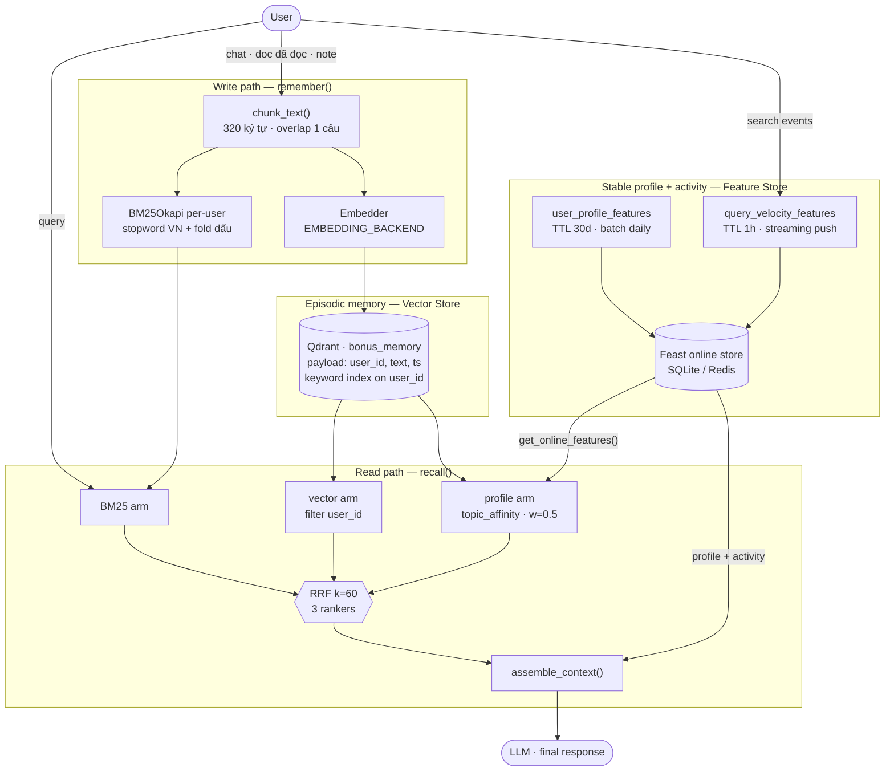

# Hybrid Memory — trợ lý AI cá nhân cho người dùng Việt

**Contributors:** Lý Nhật Huy (A20K-K4) — solo, không pair.
**Chạy thử:** `python bonus/demo.py` (exit 0, đã test trên lite path).

Bài toán: trợ lý phải nhớ *ba thứ có nhịp thay đổi hoàn toàn khác nhau* —
hội thoại/tài liệu (mỗi phút), hồ sơ người dùng (mỗi tuần), hoạt động gần đây
(mỗi giây). Kiến trúc dưới đây tách chúng theo đúng nhịp đó thay vì nhồi vào
một store duy nhất.

---

## 1. Sơ đồ kiến trúc

---

## 2. Ba quyết định kiến trúc

### D1 · Chunking: per-turn-pair ~320 ký tự, overlap 1 câu

**X vs Y:** *per-message* cho retrieval precision cao nhất nhưng vỡ mạch hội
thoại — câu trả lời "Đúng rồi, dùng HPA đi" mất hoàn toàn ngữ cảnh câu hỏi.
*Per-conversation* giữ mạch nhưng một cuộc chat 2 tiếng thành 1 vector duy
nhất, embedding bị trung bình hoá và recall sụp. **Chọn per-turn-pair,
cap ~320 ký tự (≈80 token tiếng Việt), overlap 1 câu.**

**Tradeoff explicit:**

| | retrieval quality | storage cost | context window |
|---|---|---|---|
| per-message | cao, nhưng mất mạch | ×3 số vector | rẻ, nhiều mảnh vụn |
| per-conversation | thấp (averaging) | ×0.2 | 1 chunk có thể nuốt 4k token |
| **per-turn-pair 320c** | **tốt, giữ mạch** | baseline | **top-3 ≈ 240 token — vừa 1 prompt** |

Lý do chốt con số 320: top-3 memories phải lọt vào phần ngân sách context còn
lại *sau khi* đã trừ system prompt + profile block. Overlap 1 câu là bảo hiểm
rẻ cho trường hợp ý nghĩa nằm vắt qua đường cắt.

### D2 · Feature schema: tabular-first, embedding-feature để sau

| feature | entity | TTL | source | nhịp |
|---|---|---|---|---|
| `reading_speed_wpm` | user | 30d | batch warehouse | tuần |
| `preferred_language` | user | 30d | batch | tháng |
| `topic_affinity` | user | 30d | batch (agg 30d) | tuần |
| `queries_last_hour` | user | 1h | **stream push** | giây |
| `distinct_topics_24h` | user | 1h | stream push | phút |

**X vs Y:** *Embedding feature* (nén toàn bộ lịch sử đọc thành 1 vector 384-d
lưu trong feature view) biểu diễn được sở thích tiềm ẩn mà không cần bảng
taxonomy. Nhưng nó **không debug được** — khi trợ lý gợi ý sai, không ai trả
lời được "tại sao", và mỗi lần đổi embedding model là phải backfill lại toàn
bộ offline store, phá vỡ mọi PIT join đã materialize. **Chọn tabular** vì ở
POC, khả năng giải thích quan trọng hơn 1–2 điểm nDCG.

**Quyết định phái sinh — profile phải đổi *thứ hạng*, không chỉ in ra màn
hình.** `topic_affinity` được đưa vào RRF thành **ranker thứ ba** với trọng
số 0.5, thay vì 2 ranker như NB2. Nửa trọng số là có chủ đích: profile là dữ
liệu *cũ nhất* trong hệ thống (TTL 30 ngày), nên nó được quyền hích nhưng
không được quyền lấn câu hỏi người dùng vừa gõ.

**Khi nào PIT join trở thành bắt buộc.** Chừng nào trọng số 0.5 còn là hằng
số tôi tự chọn thì chưa cần training data. Nhưng bước tiếp theo hiển nhiên là
*học* trọng số đó từ hành vi click — và lúc ấy mỗi dòng training là
`(user_id, query, memory_id, ts, clicked)`, phải join với giá trị
`topic_affinity` **tại thời điểm ts**, không phải giá trị hôm nay.
`get_historical_features()` làm đúng việc này; một `GROUP BY user_id` +
`MAX(timestamp)` thì không. NB8 đo được khoảng cách đó: latest-join kéo
AUC train lên cao giả tạo rồi sập khi lên production. Đây là lý do episodic
memory *không* nằm trong feature store nhưng label log của nó thì **phải** —
xem §3.

Arm thứ ba dùng **vector chứ không phải BM25** — và đây là bug tôi đã đo
được rồi mới sửa: BM25 với query `"cloud"` đẩy đúng cái note viết *"không
liên quan cloud nhưng lưu lại"* lên hạng 1. Affinity là *khái niệm*, khớp
theo nghĩa mới đúng; nên `AFFINITY_QUERY` expand `"cloud"` → `"điện toán đám
mây, kubernetes, container, hạ tầng cloud"` trước khi embed.

### D3 · Freshness: ba tốc độ cho ba use case

| use case | độ trễ chấp nhận | cơ chế | vì sao |
|---|---|---|---|
| "Tôi vừa đọc xong tài liệu này" → recall phải thấy ngay | **sub-second** | `remember()` ghi thẳng Qdrant (đồng bộ) + Feast **Push API** cho `queries_last_hour` | user vừa làm xong hành động; trễ 5 phút là trợ lý "bị điếc" ngay trước mặt |
| "Gợi ý đọc gì tiếp" (`topic_affinity`) | **daily batch** | materialize-incremental ban đêm, TTL 30d | sở thích dịch chuyển theo tuần; refresh mỗi phút chỉ đốt compute và làm gợi ý nhiễu |
| "Tài liệu nào đang hot" (`click_count_24h`) | **hourly** | batch + stream merge, TTL 24h | popularity phân rã theo giờ; daily thì đã lỗi thời, sub-second thì thừa |

Nguyên tắc rút ra: **TTL phải bằng nhịp thay đổi thật của feature, không phải
nhịp bạn muốn nó tươi.** Đặt `query_velocity` TTL 30 ngày thì online store trả
về số liệu của tháng trước mà *không hề báo lỗi* — đó chính xác là cái bẫy
NB4 cảnh báo.

---

## 3. Lựa chọn đã loại bỏ (và vì sao)

**Tôi đã cân nhắc lưu episodic memory ngay trong Feature Store** dưới dạng một
embedding feature view (`user_memory_embeddings`, entity = user, giá trị =
list vector), để cả hệ thống chỉ còn *một* storage layer, một cơ chế PIT join,
một registry.

**Đã loại, vì hai vòng đời không thể ép chung:**

1. **Nhịp ghi lệch nhau 3 bậc độ lớn.** Memory sinh ra mỗi phút; profile
   materialize mỗi ngày. Feast materialize theo *batch trên toàn entity* —
   muốn memory tươi thì phải chạy job toàn bộ user mỗi phút, tức là trả giá
   batch cho một workload streaming.
2. **Feature Store không có ANN.** Nó là key-value lookup theo entity key.
   Lấy được list vector về rồi vẫn phải tự tính cosine phía client trên
   *toàn bộ* memory của user — chính là `pre_filter` trong NB5, mất sạch
   index, O(N) theo số ký ức. Với user 2 năm tuổi đời thì đó là vài chục
   nghìn vector mỗi query.

Nên: **Qdrant giữ thứ cần ANN + filter, Feast giữ thứ cần PIT join + TTL.**
Ranh giới là *kiểu truy vấn*, không phải kiểu dữ liệu.

---

## 4. Bối cảnh Việt Nam

**Code-switching là mặc định, không phải ngoại lệ.** Người dùng VN viết
*"deploy con service này lên cloud rồi set autoscale giùm"* — một câu, hai
ngôn ngữ. Hệ quả: không thể chọn model embedding đơn ngữ. Default của lab
(`bge-small-en-v1.5`) là model **tiếng Anh**, và đó chính là lý do NB2 cho
thấy vector *thua* BM25 ở nhóm paraphrase (24.0% vs 33.3%). Production phải
đặt `EMBEDDING_BACKEND=multilingual` hoặc `bge-m3`.

**Gõ không dấu.** "co giãn" ↔ "co gian", "đám mây" ↔ "dam may". `fold()` bỏ
dấu bằng NFD + strip combining marks (và `đ`→`d`), rồi index **cả hai** dạng
vào BM25. Một dòng code, cứu toàn bộ nhóm query gõ vội trên mobile.

**Tokenizer — X vs Y:** `underthesea`/`pyvi` tách từ ghép đúng
("cơ sở dữ liệu" = 1 từ, không phải 3), nhưng thêm ~200 MB phụ thuộc và
~15ms/query, và **tách sai chính chỗ code-switching** vì từ điển không có
"autoscale", "pod", "replica". **Chọn whitespace + stopword + fold dấu** cho
POC: thua ở văn bản thuần Việt, hoà ở văn bản pha — mà văn bản pha mới là
phần lớn dữ liệu thật. Đây là quyết định để xem lại khi có golden set tiếng
Việt riêng.

**Stopword là bắt buộc ở quy mô per-user.** Corpus lab có 1000 doc nên IDF tự
triệt tiêu hư từ. Bộ nhớ *một người dùng* chỉ có vài chục chunk — IDF quá
mỏng. Đo được: bỏ stopword VN nâng hit@1 của arm BM25 từ 3/5 lên 4/5, và
hybrid từ 4/5 lên 5/5 (bảng ablation in ra cuối `demo.py`).

**Nghị định 13/2023/NĐ-CP.** Ký ức cá nhân là dữ liệu cá nhân: cần cơ sở pháp
lý để xử lý, và quyền xoá phải thực thi được. Kiến trúc hiện tại đã chuẩn bị
sẵn `user_id` làm payload có index → xoá theo `Filter(user_id=...)` là một
lệnh, không phải rebuild index. Isolation được kiểm tra thẳng trong demo:
`u_042` hỏi đúng câu của `u_001` và nhận về rỗng.

---

## 5. Bằng chứng đo được

`demo.py` in bảng ablation trên 5 query (hit@1, 6 ký ức seed):

| BM25 | vector | hybrid | hybrid + profile |
|---:|---:|---:|---:|
| 4/5 | 5/5 | **5/5** | **5/5** |

Đọc bảng này một cách trung thực: ở quy mô POC, **hybrid chưa thắng được
vector thuần** — nó chỉ hoà. Kết luận ngược với NB2 (nơi hybrid thắng), và lý
do là *cold start*: BM25 cần khối lượng corpus để IDF có nghĩa, mà bộ nhớ mỗi
user bắt đầu từ số không. Suy ra một quyết định vận hành: **trọng số arm BM25
nên tăng dần theo số chunk của user**, chứ không cố định 1.0 từ ngày đầu.
Đây là điều tôi không dự đoán trước khi đo.

---

## 6. What this POC doesn't handle yet

- **Isolation mới ở mức logic.** Filter theo payload `user_id` chống nhầm lẫn,
  không chống kẻ tấn công đọc được file collection. Thật sự cần: per-user
  collection hoặc encryption-at-rest theo khoá riêng từng user.
- **Không có CRUD trên ký ức.** `remember()` chỉ ghi thêm; chưa có
  update/delete/dedup. User sửa một fact sai → hai phiên bản mâu thuẫn cùng
  nằm trong index.
- **Chưa có memory decay.** Ký ức 2 năm trước và ký ức hôm qua cạnh tranh
  ngang nhau. `ts` đã lưu sẵn trong payload nhưng chưa dùng để hạ điểm.
- **Chưa consolidation.** 5 ký ức na ná nhau vẫn là 5 vector; chưa gộp thành
  summary định kỳ.
- **BM25 rebuild toàn bộ** mỗi khi user thêm memory — O(N) mỗi lần ghi, chấp
  nhận được ở vài chục chunk, không chấp nhận được ở vài chục nghìn.
- **Streaming mới là mô phỏng.** `queries_last_hour` đọc từ Parquet đã
  materialize sẵn (NB4), chưa nối Feast Push API thật.
- **Chưa multi-device sync**, chưa audit log cho việc truy cập ký ức.

---

## 7. Vibe-coding log

**Prompt hiệu quả nhất:** đưa nguyên `app/search.py` + `app/feast_repo/feature_views.py`
vào context rồi yêu cầu *"viết agent tái sử dụng `Embedder` và hằng số RRF
k=60, đừng định nghĩa lại"*. Kết quả bám đúng convention của repo, không sinh
ra lớp trừu tượng thừa.

**Prompt thất bại:** *"viết hybrid memory agent cho trợ lý tiếng Việt"* —
nhận về code embed lại corpus từ đầu, hardcode 384 chiều, và bịa ra một
`MemoryStore` không liên quan gì tới Feast. Bài học: mô tả *ràng buộc và file
phải tái sử dụng*, đừng mô tả *sản phẩm mong muốn*.

**Phần AI làm không nổi:** chọn TTL, chọn trọng số 0.5 cho arm profile, và
nhận ra arm affinity phải là vector chứ không phải BM25. Cái cuối chỉ lộ ra
khi *chạy thật rồi nhìn output* — AI viết bản BM25 rất tự tin, và nó sai theo
đúng kiểu chỉ có dữ liệu tiếng Việt mới phơi bày được.
